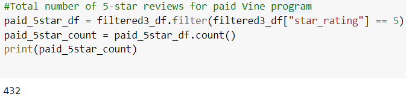

# Amazon_Vine_Analysis
Analysing Amazon reviews  written by members of the paid Amazon vine program using Pyspark and AWS .

## Purpose and Overview of the project

The Amazon vine program is a service that allows manufacturers and publishers to receive reviews on their product. Companies like SellBy pay a small fee to Amazon and provide products to 
Amazon Vine members, who are then required to publish a review. In this project we have used toys dataset that contains reviews for each of the toy product. We have used Pyspark which is
a python based version of Spark. Spark is a unified analytics engine for large scale data processing, mainly big data. Spark uses in-memory computation instead of a disk-based solution,
which means it doesn't need to talk to the HDFS each time and can retain as much as HDFS can in-memory. 
In this project we have used Pyspark to perform the ETL process that is extract the dataset ,transform the data and load the data into the database.We have used AWS for this job by
creating an AWS RDS instance and connecting it to the PgAdmin to use Postgres SQL through the RDS server. The Pyspark script is run through the google colab notebbook. We have used
Pyspark to determine if there is any bias towards favourable reviews from the Vine members.

## Results 

- How many Vine reviews and non-Vine reviews were there?
	
  There are 1,266 reviews from the vine members and 62,028 reviews from the non-vine members. We can see from the snapshot below the total number of reviews for the vine members 
  is quite lesser then the non-vine members as the number of people enrolled under the Amazon vine program will definitely be smaller than the normal customers.
  
   
   
   
   
   
   
   
   

- How many Vine reviews were 5 stars? How many non-Vine reviews were 5 stars?

  There are a total of 432 5-star reviews from the vine members and 29,982 5-star reviews from the non-vine members.
  
  
  
  
  
- What percentage of Vine reviews were 5 stars? What percentage of non-Vine reviews were 5 stars?

  34.12% of the total vine reviews are 5-star reviews whereas 48.33% of the total non-vine reviews are 5-star reviews. We can clearly see this from the snap below. The total 
  percentage of 5-star reviews is lesser for the vine members than the non-vine members. 
  
  
  
  
  
  
## Summary

1. As we can see the percentage of the 5-star reviews from the vine members is less (34.12%) than the non-vine members (48.33%) . This states that there is no positivity bias
   in the reviews of vine and non-vine members. The customers who have purchased the products and are really satisfied with the product have provided a 5-star rating. Also 
   their reviews were found really helpful as we have done the analysis on the basis of atleast 50% of total votes being helpful votes.

2. The analysis has been made on the toys dataset , so we can say that the products are mostly in interest of the kids and teenage children than the adults. So even being 
	a vine member , a customer has given an honest review on the toy product. The vine members are provided with free toy products but still the 5-star rating percentage is 
	lesser than non-vine members where customers have purchased the toy product and provided their reviews.
	
3. We can do an additional analysis on the field of verified purchase and the review headline. We can make a check where the customer who is reviewing the product has made a 
   verified purchase for the non-vine members. This way we can make sure that the customer has actually purchased the product from amazon and there is no possibility of a biased
   review. Also the review headline can be analysed for a positive and a negative reviews and we can make sure the ratings provided by the customer is in sync with the review
   he actually provided.

   
  
   
   
   
   

	
